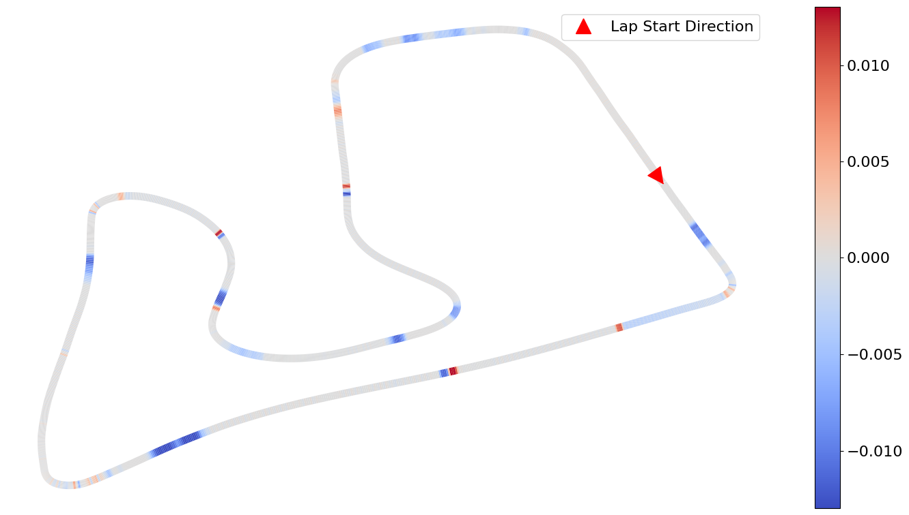
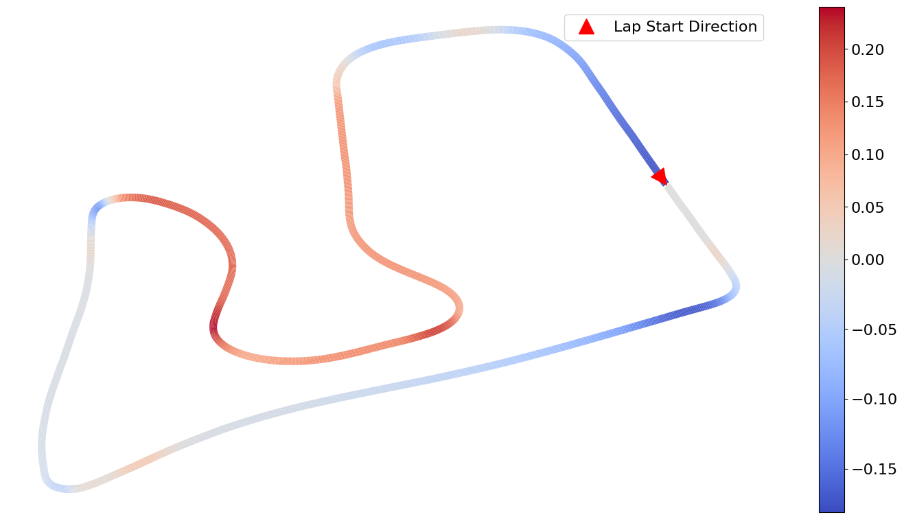
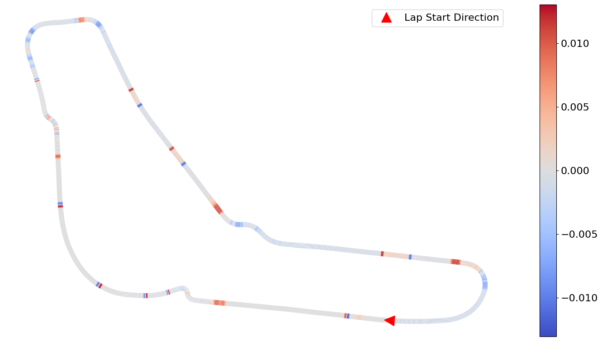
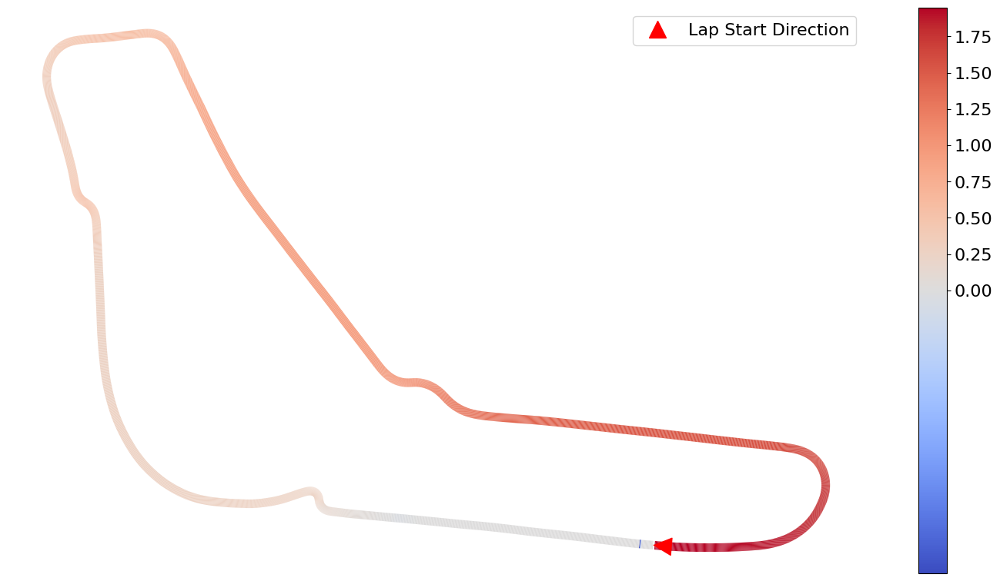

# 🏎️ Energy-Efficient Autonomous Racing with Reinforcement Learning


## 📑 Table of Contents
- [🚗 Overview](#-overview)
- [✨ Key Features](#-key-features)
- [🔧 Extensions from Assetto Corsa Gym](#-extensions-from-assetto-corsa-gym)
  - [🏁 Reward Function Modification](#-reward-function-modification)
  - [📊 Added Metrics](#-added-metrics)
- [🧪 Experiments](#-experiments)
  - [📈 Performance Comparison](#-performance-comparison)
  - [📝 Summary of Results](#-summary-of-results)
- [⚙️ Getting Started](#-getting-started)
  - [📦 Installation](#-installation)
  - [🎮 Demos](#-demos)
  - [📋 Benchmarks](#-benchmarks)
- [🔭 Future Work](#-future-work)
- [🤝 Contributing](#-contributing)
- [⚖️ License](#-license)
- [🙌 Acknowledgments](#-acknowledgments)

## 🚗 Overview

Balancing speed and energy efficiency in Assetto Corsa.

Environment for training and benchmarking energy-efficient autonomous agents in the [Assetto Corsa](https://assettocorsa.gg/) racing simulator. Extended from the [Assetto Corsa Gym](https://github.com/dasGringuen/assetto_corsa_gym) framework with modifications for fuel consumption tracking and a configurable reward function that incentivizes energy efficiency. Developed as part of a Bachelor's thesis at NaUKMA.


## ✨ Key Features
- Fuel consumption metrics integrated into the environment
- Customizable reward coefficient to penalize fuel use
- High-fidelity simulation for testing in realistic conditions
- Compatibility with various tracks and cars

## 🔧 Extensions from Assetto Corsa Gym
### 🏁 Reward Function Modification

To encourage fuel efficiency, we modified the reward function from AssettoCorsaGym by adding a penalty for fuel consumption, alongside the original terms for speed and path deviation. The new reward is computed as:

$$
r = v \cdot (1 - a \cdot d) - b \cdot f
$$

where:
- $v$ is the vehicle's speed,
- $d$ is the L2 distance from the optimal path,
- $a$ is the deviation penalty coefficient,
- $f$ is the fuel consumed since the previous timestep,
- $b$ controls the strength of the fuel penalty.

Fuel consumption $f$ is **not** included in the agent's observation space, requiring the agent to learn energy efficiency indirectly through reward changes.

The strength of the fuel penalty is controlled by:

- `AssettoCorsa.penalize_fuel_consumption_coef` - the value of $b$

- `AssettoCorsa.penalize_fuel_consumption` - a boolean flag to toggle the penalty

Both variables can be modified in the `config.yml` file.

We trained the agents with four different values of $b$ to produce approximate reductions of 2%, 5%, 10%, and 20% relative to the original reward function (i.e., with $b = 0$). The required value of $b$ differs depending on the car, as fuel consumption varies by vehicle model due to weight, aerodynamics, gearing, engine characteristics, etc. 

The coefficients used in our experiments are:
| Car Model  | 2% Penalty | 5% Penalty | 10% Penalty | 20% Penalty |
| ---------- | ---------- | ---------- | ----------- | ----------- |
| BMW Z4 GT3 | 13.9        | 36.0        | 71.9         | 143.9        |
| F317  | 24.9        | 62.3        | 124.0        | 248.0        |


### 📊 Added Metrics

The following metrics have been added in the simulation `summary.csv` file:
- `BestLapFuel`: Fuel used on the lap with the lowest fuel consumption
- `LapNo_i_Fuel`: Fuel consumed during lap `i` of the episode

The following metrics have been added in the simulation `.csv` output files for each episode:
- `fuel`: Remaining fuel in the car at the current simulation step
- `fuel_diff`: Change in fuel level since the previous step


## 🧪 Experiments

Our experiments demonstrate that reinforcement learning agents can adapt to energy-efficient reward functions. We highlight two representative models using the BMW Z4 GT3 car:
- One trained with a 5% fuel penalty on the Austria (RBR) track
- Another trained with a 2% penalty on the Monza (MNZ) track

We used the **Soft Actor-Critic (SAC)** algorithm for all experiments. Training and evaluation were conducted on an **RTX 3060 laptop GPU**. On average, each 500-episode training run took approximately **36 hours**.

### 📈 Performance Comparison

<table>
  <caption><strong>Performance comparison of agents trained under different fuel penalties</strong></caption>
  <thead>
    <tr>
      <th>Fuel Penalty</th>
      <th>Best Lap Time (s) ↓</th>
      <th>Mean Lap Time (s) ↓</th>
      <th>FC for Best Lap (L) ↓</th>
      <th>Mean FC Per Lap (L) ↓</th>
      <th>Training Episodes</th>
    </tr>
  </thead>
  <tbody>
    <tr>
      <td colspan="6" align="center"><strong>Track: Austria, Car: BMW Z4 GT3</strong></td>
    </tr>
    <tr>
      <td>0%</td>
      <td>92.964</td>
      <td>92.975</td>
      <td>1.842</td>
      <td>1.841</td>
      <td>768</td>
    </tr>
    <tr>
      <td>5%</td>
      <td><strong>92.784</strong></td>
      <td><strong>92.796</strong></td>
      <td><strong>1.646</strong></td>
      <td><strong>1.644</strong></td>
      <td>474</td>
    </tr>
    <tr>
      <td colspan="6" align="center"><strong>Track: Monza, Car: BMW Z4 GT3</strong></td>
    </tr>
    <tr>
      <td>0%</td>
      <td><strong>112.089</strong></td>
      <td><strong>112.109</strong></td>
      <td>2.402</td>
      <td>2.403</td>
      <td>560</td>
    </tr>
    <tr>
      <td>2%</td>
      <td>114.040</td>
      <td>114.203</td>
      <td><strong>2.367</strong></td>
      <td><strong>2.366</strong></td>
      <td>595</td>
    </tr>
  </tbody>
</table>

<table>
  <caption align="center"><strong>Austria Comparison (5% Penalty – No Penalty)</strong></caption>
  <tr>
    <td align="center"><strong>Fuel Usage Difference</strong><br>
      10.7% ↓ $${\color{lightblue}(-0.19 L)}$$
      <br>
    </td>
    <td align="center"><strong>Lap Time Difference</strong><br>
      0.2% ↓ $${\color{lightblue}(-0.18 s)}$$
    </td>
  </tr>
  <tr>
    <td></td>
    <td></td>
  </tr>
  <tr>
    <td align="left">
      $${\color{lightblue}■}$$: penalized model saves fuel</li><br>
      $${\color{red}■}$$: penalized model consumes more</li>
    </td>
    <td align="left">
      $${\color{lightblue}■}$$: penalized model is ahead</li><br>
      $${\color{red}■}$$: penalized model is behind</li>
    </td>
  </tr>
</table>

<table>
  <caption align="center"><strong>Monza Comparison (2% Penalty – No Penalty)</strong></caption>
  <tr>
    <td align="center"><strong>Fuel Usage Difference</strong><br>
      1.46% ↓ $${\color{lightblue}(-0.035 L)}$$
      <br>
    </td>
    <td align="center"><strong>Lap Time Difference</strong><br>
      1.74% ↑ 
        $${\color{red}(+1.95 s)}$$
    </td>
  </tr>
  <tr>
    <td></td>
    <td></td>
  </tr>
   <tr>
    <td align="left">
      $${\color{lightblue}■}$$: penalized model saves fuel</li><br>
      $${\color{red}■}$$: penalized model consumes more</li>
    </td>
    <td align="left">
      $${\color{lightblue}■}$$: penalized model is ahead</li><br>
      $${\color{red}■}$$: penalized model is behind</li>
    </td>
  </tr>
</table>

### 📝 Summary of Results


Our experiments show that adding a fuel consumption penalty to the reward function leads to more fuel-efficient policies without significantly reducing lap time. 
- **Austria (RBR)** - a medium difficulty track: \
mild penalties often improved both fuel efficiency and speed. 
- **Monza (MNZ)** - a more complex track: \
even a 2% penalty impaired performance, and higher penalties prevented agents from completing valid laps

These results indicate that the effectiveness of fuel penalties are highly track-dependent. On easier tracks, agents can use the penalty to improve driving smoothness and efficiency. On more complex tracks, aggressive penalties can undermine learning altogether.


## ⚙️ Getting Started
### 📦 Installation

1. **Install the AC plug-in**
    Follow the instructions in [`INSTALL.md`](INSTALL.md)


1. **Install Python in Windows**

    - **Install Visual Studio Compiler**
      - To compile the necessary components for the plugin, download and install the Visual Studio compiler from:
      [Visual Studio C++ Build Tools](https://visualstudio.microsoft.com/visual-cpp-build-tools/)
      - Make sure to install the C++ build tools component

    - **Install Python using Anaconda**
      ```
      conda create -n p309 python=3.9.13
      conda activate p309
      pip install setuptools==65.5.0 "cython<3"
      pip install "wheel<0.40.0"
      python -m pip install pip==24.0
      pip install -r requirements.txt
      conda install pytorch==1.12.1 cudatoolkit=11.6 -c pytorch -c conda-forge
      ```

2. **Download the tracks occupancy grid**
    - Get the files from here [tracks](https://huggingface.co/datasets/dasgringuen/assettoCorsaGym/tree/main/AssettoCorsaConfigs/tracks).
    - Optionally, download them using the Huggingface Hub interface:
      - Install it: `conda install -c conda-forge huggingface_hub`
      - And run:
        ```sh
        python -c "from huggingface_hub import snapshot_download; snapshot_download(repo_id='dasgringuen/assettoCorsaGym', repo_type='dataset', local_dir='AssettoCorsaGymDataSet', allow_patterns='AssettoCorsaConfigs/tracks/*')"
        ```
      - Move the pickle files to `assetto_corsa_gym/AssettoCorsaConfigs/tracks`.

    - To create a new track:
      - Each track needs an occupancy grid (pickle), a reference line (can be the one from AC but also something else), and the track bounds. These files are located in `assetto_corsa_gym/AssettoCorsaConfigs/tracks`.
      - The reference line and the occupancy grid are needed to run the Gym interface. 
      - Create the occupancy grid, the reference path and the track bounds:
        - Start Assetto Corsa and set the new track.
        - Run `assetto_corsa_gym/AssettoCorsaConfigs/tracks/generate_track.ipynb` to create a new track. This script creates a pickle file with the occupancy grid, downloads the AC reference path, and visualizes the track. Make sure to update the `assetto_corsa_gym/AssettoCorsaConfigs/tracks/config.yaml` file.

### 🎮 Demos
- **test_client.ipynb**
  - Demonstrates the use of the Assetto Corsa Sim interface (client) without the OpenAI Gym interface layer.

- **test_gym.ipynb**
  - Demonstrates the use of the Gym interface without an agent.


### 📋 Benchmarks
Experiments and parameters are configured via `config.yml` and executed with `python train.py`. Optionally, a different config file can be specified using `python train.py config=<config_file>`. To enable logging to Weights and Biases, appropriate values should be set in the config file. Each parameter in the config file can be modified directly from the terminal using `<field>=<value>`. For instance, to change the car, use `AssettoCorsa.car=<car>`.

  - **Example policy for Monza and the GT3 car**

    The checkpoints are in the dataset (see below). The expected lap time is approximately 112.1 seconds.
    ```
    python train.py --test --load_path <path_to_dataset>\monza\bmw_z4_gt3\20241108_SAC\model\checkpoints\step_05400000 AssettoCorsa.track=monza AssettoCorsa.car=bmw_z4_gt3
    ```

  - **Train from SAC from Scratch**
    - To train SAC from scratch in Barcelona/F317:
      ```
      python train.py
      ```

    - To train on other cars and tracks (ensure the car and track are set first in AC):

      ```
      python train.py AssettoCorsa.track=<track> AssettoCorsa.car=<car>
      ```
      Example for Monza GT3:
      ```
      python train.py AssettoCorsa.track=monza AssettoCorsa.car=bmw_z4_gt3
      ```

- **Test a model by loading a checkpoint**
  ```
  python train.py --test --load_path <path_to_model> AssettoCorsa.track=<track> AssettoCorsa.car=<car>
  ```

- **Train SAC from demonstrations using an ensemble of buffers**
  - Update ac_offline_train_paths.yml (see available data in data\paths.yml).

  - Run:
    ```
    python train.py load_offline_data=True Agent.use_offline_buffer=True dataset_path=<path_to_dataset>
    ```

## 🔭 Future Work

We highlight the ability of RL agents to adopt fuel-efficient behaviors given appropriate reward shaping. However, several limitations remain that could be explored in future work.
1. Experiments were limited to two vehicles and two tracks, raising concerns about generalizability. Particularly since strategies learned on the simpler Austria track did not entirely transfer to Monza.
2. Agents lacked manual gear-shifting control and could only influence gears indirectly via speed. This restricted fuel-saving techniques like short-shifting.
3. AC simulator runs only in real time, considerably slowing down training (~36 hours per 500 training episodes on RTX 3060). This limited our ability to test alternative reward designs or repeat training with different random seeds to ensure stability.
4. Only one reward function design was explored. Future work could explore alternative formulations, like penalizing fuel-related factors directly or adding a short history of past fuel usage to the state space.
5. Fuel usage was excluded from the observation space of the agent to simulate partial observability. While it did not prevent the agent from learning efficient strategies, future work could compare outcomes with and without partial observability.
6. The environment has only been tested with the SAC algorithm, and future work could test these methods with other RL algorithms, or with classical control frameworks like MPC, LQR or PID.


## 🤝 Contributing

You are very welcome to contribute to this project. Feel free to open an issue or pull request if you have any suggestions or bug reports, but please review our [guidelines](CONTRIBUTING.md) first. Our goal is to build a codebase that can easily be extended to new environments and tasks, and we would love to hear about your experience!

## ⚖️ License

This project is licensed under the MIT License - see the `LICENSE` file for details. Note that the repository relies on third-party code, which is subject to their respective licenses.

## 🙌 Acknowledgments

- [AssettoCorsaGym](https://assetto-corsa-gym.github.io/) \
  This works builds on the AssettoCorsaGym framework. Please cite the original paper if using this environment.
- [Assetto Corsa](https://assettocorsa.gg/) \
  The Assetto Corsa simulation environment was used solely for the purposes of this research. We do not intend to use it in any public-facing or commercial context, nor in any activity involving public distribution or display. Assetto Corsa is publicly available on the Steam platform. **For research usage, appropriate permission should be obtained from the Assetto Corsa Support**
- [Virtual Steward mod](https://www.overtake.gg/downloads/virtual-steward.65530/) \
  The mod was used to generate the result visualizations seen in the overview animation (i.e. right side of the animation showing driving behavior changes) 
